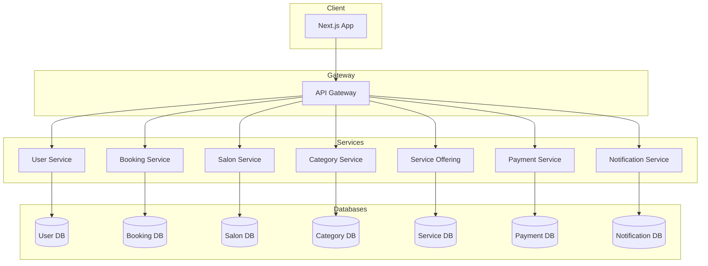

# 💇‍♂️ King Salon App

> A full-stack salon booking platform built with microservices architecture — designed for scalability, real-time interactions, and seamless customer experience.


---

## 📋 Table of Contents

- [Overview](#-overview)
- [Features](#-features)
- [Tech Stack](#-tech-stack)
- [System Architecture](#-system-architecture)
- [Microservices](#-microservices)
- [Getting Started](#-getting-started)
- [Environment Variables](#-environment-variables)
- [API Documentation](#-api-documentation)

---

## 🌟 Overview

**King Salon** is a modern salon management and booking platform that connects customers with salons. Customers can browse salons, book appointments, and pay online — while salon owners manage staff, services, and schedules through a unified dashboard.

The backend is designed as a microservices system, with each service independently deployable, scalable, and maintainable.

---

## ✨ Features

| Feature                        | Description                                                             |
| ------------------------------ | ----------------------------------------------------------------------- |
| 📅 **Online Booking**          | Browse salons, select services, choose staff and time slots             |
| 🏪 **Salon Management**        | Salon owners manage services, working hours, and staff                  |
| 👥 **Staff Management**        | Assign staff to services, manage availability                           |
| 💳 **Online Payment**          | Secure payment processing integrated into the booking flow              |
| 🔔 **Real-time Notifications** | Instant updates on bookings, confirmations, and reminders via WebSocket |
| 🔐 **Auth & Security**         | JWT-based authentication with OAuth2 social login support               |

---

## 🛠 Tech Stack

### Frontend

- **Next.js** — React framework with SSR/SSG
- **Tailwind CSS** — Utility-first styling
- **Shadcn UI** — Accessible component library

### Backend (Microservices)

- **Java 17 + Spring Boot** — Core framework for all services
- **Hibernate / JPA** — ORM for database interaction
- **Lombok + MapStruct** — Boilerplate reduction and object mapping
- **JWT + OAuth2** — Authentication & authorization
- **Eureka Server / Client** — Register routing service name
- **Open Feign Client** — Services Communication Request
- **WebSocket (Socket.IO)** — Real-time notification delivery

### Infrastructure & Data

- **MySQL** — Relational database (per-service)
- **Firebase** — Push notification support
- **API Gateway** — Single entry point for all clients
- **Docker + Docker Compose** — Containerized deployment

---

## 🏗 System Architecture



---

## 🧩 Microservices

| Service              | Port   | Responsibility                                    |
| -------------------- | ------ | ------------------------------------------------- |
| **API Gateway**      | `5000` | Route requests, JWT validation, load balancing    |
| **User Service**     | `5001` | Registration, login, profile management           |
| **Salon Service**    | `5002` | Salon CRUD, working hours, location               |
| **Booking Service**  | `5005` | Appointment creation, scheduling, status tracking |
| **Category Service** | `5003` | Service categories (haircut, coloring, etc.)      |
| **Service Offering** | `5004` | Individual services offered by salons             |
| **Payment Service**  | `5006` | Payment processing and transaction history        |
| **Notifications**    | `5007` | Push & WebSocket notifications                    |

---

## 🚀 Getting Started

### Prerequisites

- [Docker](https://www.docker.com/) & Docker Compose v2+
- [Node.js](https://nodejs.org/) >= 18 (for frontend)
- [Java 17+](https://adoptium.net/) (for local dev without Docker)

### Installation

**1. Clone the repository**

```bash
git clone https://github.com/kaicity/king-salon-app.git
cd king-salon-app
```

**2. Configure environment variables**

```bash
cp .env.example .env
# Edit .env with your credentials (see Environment Variables section)
```

**3. Start all services with Docker Compose**

```bash
docker-compose up --build
```

**4. Access the application**

| Service     | URL                   |
| ----------- | --------------------- |
| Frontend    | http://localhost:3000 |
| API Gateway | http://localhost:5000 |

### Running Frontend Separately (Development)

```bash
cd frontend
npm install
npm run dev
```

---

## 🔐 Environment Variables

Create a `.env` file at the root of the project. Below are the required variables:

```env
# Database
MYSQL_ROOT_PASSWORD=your_password
MYSQL_DATABASE=king_salon

# JWT
JWT_SECRET=your_jwt_secret_key
JWT_EXPIRATION=86400000

# Firebase (Notifications)
FIREBASE_PROJECT_ID=your_firebase_project_id
FIREBASE_PRIVATE_KEY=your_private_key
FIREBASE_CLIENT_EMAIL=your_client_email

# Payment Gateway
PAYMENT_API_KEY=your_payment_api_key
PAYMENT_SECRET=your_payment_secret

# OAuth2 (optional)
GOOGLE_CLIENT_ID=your_google_client_id
GOOGLE_CLIENT_SECRET=your_google_client_secret
```

---

## 📖 API Documentation

API exploration:

| Service          | API URL                                          |
| ---------------- | ------------------------------------------------ |
| API Gateway      | http://localhost:5000/api/<eureka-service-name>/ |
| User Service     | http://localhost:5001/api/users/                 |
| Salon Service    | http://localhost:5002/api/salons/                |
| Category Service | http://localhost:5003/api/categories/            |
| Service Offering | http://localhost:5004/api/service-offering/      |
| Booking Service  | http://localhost:5005/api/bookings/              |
| Payment Service  | http://localhost:5006/api/payments/              |
| Notifications    | http://localhost:5006/api/notifications/         |

> A Postman collection is available in `/docs/postman_collection.json`

---

## 📄 License

This project is for educational and portfolio purposes.  
© 2024 King Salon App. All rights reserved.
